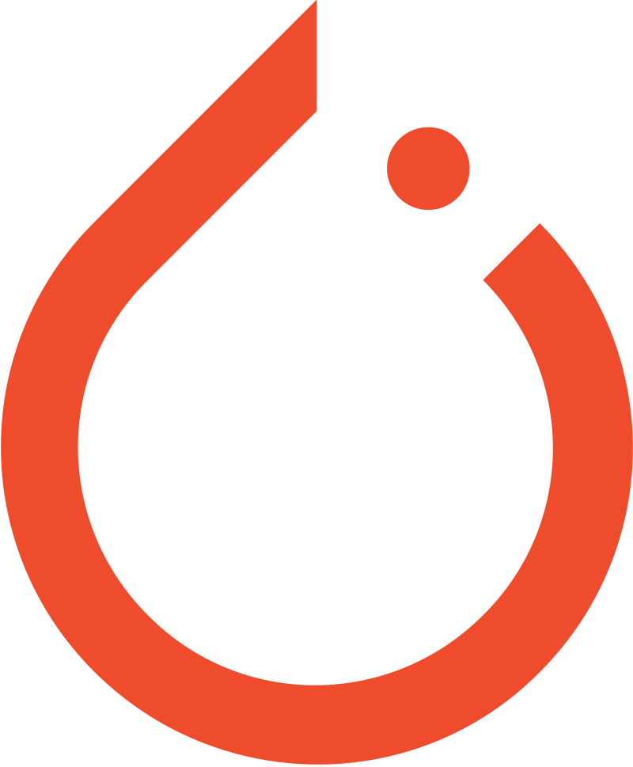

# Hi I'm b3nny01 👋

Hi, I'm a first year Computer Engineering MSc student at the University of Bologna 🎓.` `
I have been strongly passionate about informatics since high school, nowadays I'm focusing my studies on software engineering, web development and AI 👨‍💻.` `
In the future I would like to learn more about android and game development 👾.

## I work with 💻

<table>
<tr></tr>
<tr><td colspan="2"><h3>Languages</h3></td> <td colspan="2"><h3>Frameworks</h3></td></tr>
<tr>
<td><h5>General Purpose</h5> 
   
</td>
<td>
<h5>Scripting </h5> 
  
</td>
<td>
<h5>Frontend</h5> 
  
</td>
<td>
<h5>Backend</h5> 
 
</td>
</tr>
<tr></tr>
<tr>
<td>
<h5>Web</h5> 
  
</td>
<td>
<h5>Database</h5> 
 
</td>
<td >
<h5>AI</h5> 
 
</td>
</tr>
</table>
